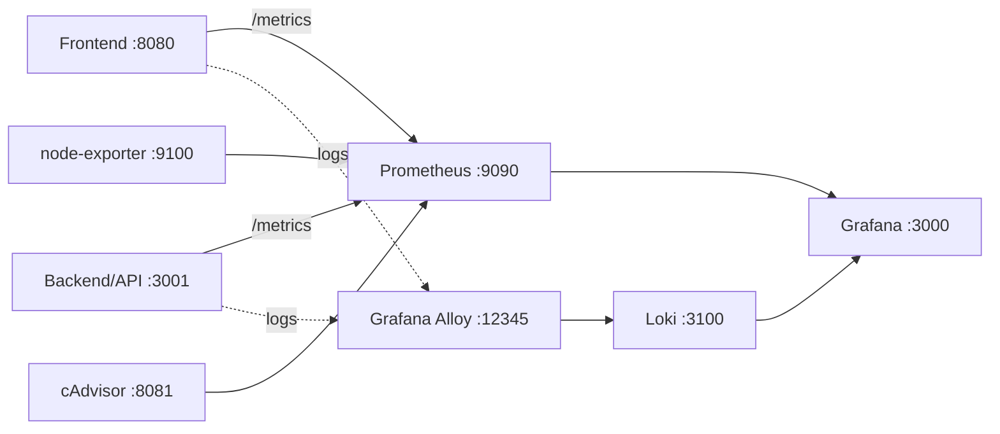

# Laboratorio de Observabilidad - Grafana, Prometheus, Loki y Alloy

Laboratorio de Infraestructura como Código para levantar un stack de observabilidad completo con Docker Compose. El stack expone métricas, recolecta logs, permite crear dashboards en Grafana y configura una alerta de CPU con webhook hacia el backend.

## Arquitectura



## Componentes del stack

- **Docker Compose**: levanta todos los servicios de forma reproducible con `docker compose up -d --build`.
- **Frontend**: aplicación Hello World en `http://localhost:8080`. Genera tráfico hacia el backend y permite iniciar carga de CPU.
- **Backend/API**: servicio Node.js en `http://localhost:3001`. Expone `/metrics`, recibe peticiones en `/api/hello`, genera carga en `/load` y recibe alertas por webhook en `/alerts`.
- **Prometheus**: recolecta, almacena y consulta métricas en series de tiempo. Se usa para dashboards y alertas.
- **Loki**: almacena logs de aplicación e infraestructura. Se consulta desde Grafana con LogQL.
- **Grafana Alloy**: reemplaza a Promtail. Recolecta logs desde el socket de Docker y los envía a Loki. Etiqueta los logs con `tier=application` para frontend/backend y `tier=infrastructure` para el resto del stack.
- **Grafana**: visualiza métricas y logs, permite crear dashboards, configurar fuentes de datos por provisioning y gestionar reglas de alerta.
- **node-exporter**: expone métricas del host.
- **cAdvisor**: expone métricas de contenedores Docker. En Docker Desktop Windows se usa el socket ` /var/run/docker.sock` para evitar problemas con montajes de rutas Linux.

## URLs del laboratorio

| Servicio | URL | Uso |
|---|---|---|
| Frontend | http://localhost:8080 | Aplicación Hello World |
| Backend | http://localhost:3001 | API, métricas, carga y webhook |
| Backend metrics | http://localhost:3001/metrics | Métricas Prometheus del backend |
| Grafana | http://localhost:3000 | Dashboards y alertas. Usuario `admin`, clave `admin` |
| Prometheus | http://localhost:9090 | Consultas PromQL y targets |
| Loki | http://localhost:3100 | Backend de logs |
| Alloy UI | http://localhost:12345 | Estado del recolector de logs |
| cAdvisor | http://localhost:8081 | Métricas de contenedores |
| node-exporter | http://localhost:9100/metrics | Métricas del host |

## Comandos principales

Levantar el stack:

```powershell
docker compose up -d --build
```

Ver estado:

```powershell
docker compose ps
```

Ver logs de un servicio:

```powershell
docker compose logs -f grafana
```

Detener sin borrar datos:

```powershell
docker compose down
```

Reset total, borrando dashboards, alertas y datos:

```powershell
docker compose down -v
```

Validar configuración:

```powershell
docker compose config
```

## Provisioning

Las fuentes de datos de Grafana están aprovisionadas como código en:

```text
grafana/provisioning/datasources/datasources.yml
```

Se crean automáticamente:

- `Prometheus`: `http://prometheus:9090`
- `Loki`: `http://loki:3100`

Esto evita crear las fuentes manualmente y hace que el laboratorio sea reproducible.

## Generar tráfico y logs

1. Abrir el frontend:

```text
http://localhost:8080
```

2. Pulsar varias veces **Saludar (API)**.
3. Dejar la pestaña abierta unos minutos para generar logs periódicos.
4. Para generar carga de CPU:

```powershell
curl "http://localhost:3001/load?seconds=60"
```

## Dashboard recomendado

Crear dashboard en Grafana:

```text
Dashboards → New → New dashboard → Add visualization
```

Nombre sugerido:

```text
Observabilidad - <nombre>
```

### Panel 1 - CPU contenedor backend

Fuente: Prometheus.

Consulta usada en este entorno:

```promql
rate(process_cpu_seconds_total[1m]) * 100
```

Configuración:

- Tipo: Time series
- Unit: Percent (0-100)
- Threshold: `50`
- Título: `CPU contenedor backend (%)`

Consulta original del laboratorio, si cAdvisor expone métricas por contenedor:

```promql
sum(rate(container_cpu_usage_seconds_total{name="lab-backend"}[1m])) * 100
```

### Panel 2 - CPU del host

Fuente: Prometheus.

```promql
100 - (avg(rate(node_cpu_seconds_total{mode="idle"}[1m])) * 100)
```

Configuración:

- Tipo: Time series
- Unit: Percent (0-100)
- Título: `CPU del host (%)`

### Panel 3 - Logs de aplicación

Fuente: Loki.

```logql
{tier="application"} | json
```

Configuración:

- Tipo: Logs
- Título: `Logs de aplicación (API + frontend)`

Filtro recomendado para errores:

```logql
{tier="application"} | json | level="ERROR"
```

### Panel 4 - Logs de infraestructura

Fuente: Loki.

```logql
{tier="infrastructure"}
```

Configuración:

- Tipo: Logs
- Título: `Logs de infraestructura`

## Alerta de CPU

Regla recomendada:

```text
CPU backend > 50%
```

Query Prometheus:

```promql
rate(process_cpu_seconds_total[1m]) * 100
```

Condición:

```text
Threshold IS ABOVE 50
```

Configuración:

- Folder: `Observabilidad`
- Rule group: `CPU Backend`
- Evaluation interval: `10s`
- Pending period: `30s`
- Label: `severity=warning`
- Contact point: webhook del backend

## Webhook para cerrar el ciclo alerta → log

Contact point:

```text
Alerting → Contact points → New contact point
```

Configuración:

```text
Name: Backend webhook
Integration: Webhook
URL: http://backend:3001/alerts
Method: POST
```

Luego, en la regla de alerta, seleccionar ese contact point.

Ciclo esperado:

```text
CPU sube → Grafana evalúa la regla → alerta pasa a Firing → webhook llama al backend → backend escribe log → Loki muestra el log
```

Log esperado en Loki:

```logql
{tier="application"} | json
```

Buscar evento:

```text
grafana_alert_received
```

## Evidencias del laboratorio

Capturas recomendadas:

1. `docker compose ps` con todos los servicios en `Up`.
2. Dashboard completo con los 4 paneles.
3. Panel `CPU contenedor backend (%)` con threshold en `50`.
4. Panel `CPU del host (%)`.
5. Panel de logs de aplicación con filtro por nivel, por ejemplo `level="ERROR"`.
6. Panel de logs de infraestructura.
7. Regla de alerta `CPU backend > 50%`.
8. Alerta en estado `Firing`.
9. Log `grafana_alert_received` en Loki.

## Respuestas de la guía

### 1. ¿Por qué necesitamos Loki además de Prometheus si ya tenemos `/metrics`?

Prometheus sirve para métricas, es decir, datos numéricos como CPU, memoria, requests o latencia. Loki sirve para logs, que son eventos en texto como errores, advertencias o trazas de la aplicación. Aunque el backend tenga `/metrics`, esos datos no reemplazan los logs, porque los logs permiten investigar qué pasó exactamente antes o después de un problema.

### 2. ¿Qué ventaja aporta que las fuentes de datos de Grafana estén aprovisionadas como código y no creadas a mano?

Aprovisionar las fuentes de datos como código permite que la configuración esté versionada, sea reproducible y no dependa de pasos manuales. Si otra persona clona el proyecto y levanta el stack, Grafana ya tendrá Prometheus y Loki configurados automáticamente. Además, reduce errores humanos y facilita auditar o recuperar la configuración.

### 3. El panel "CPU contenedor" y el panel "CPU host" pueden mostrar valores muy distintos. ¿Por qué? ¿Cuál usarías para alertar sobre una aplicación concreta?

La CPU contenedor mide el consumo de una aplicación específica, mientras que la CPU host mide el consumo total de la máquina. Pueden ser muy distintas porque el host ejecuta otros procesos, otros contenedores y servicios del sistema. Para alertar sobre una aplicación concreta se usa la CPU contenedor, porque identifica mejor el comportamiento de esa app.

### 4. ¿Qué diferencia hay entre el evaluation interval y el pending period de una alarma?

El `evaluation interval` es cada cuánto tiempo Grafana evalúa la regla de alerta, por ejemplo cada `10s`. El `pending period` es el tiempo que la condición debe mantenerse activa antes de que la alerta pase a `Firing`, por ejemplo `30s`. El primero define la frecuencia de revisión; el segundo evita alertas falsas por picos cortos.

## Adaptaciones realizadas para Docker Desktop Windows

El laboratorio original usa montajes típicos de Linux. En Docker Desktop Windows se ajustó:

- `node-exporter` para montar `C:/:/host:ro`.
- `cadvisor` para usar el socket de Docker:

```yaml
volumes:
  - /var/run/docker.sock:/var/run/docker.sock:ro
```

Esto permite levantar el stack sin el error de montaje de `/` en Windows.

## Notas

- Promtail está en fin de vida desde marzo de 2026; este laboratorio usa Grafana Alloy como recolector de logs.
- Prometheus está fijado en `prom/prometheus:v3.8.1`.
- Si se necesita reiniciar todo el laboratorio, usar `docker compose down -v`.
